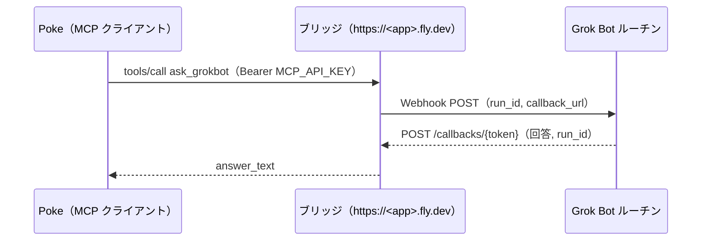

# grokbot-mcp-bridge

[English](README.md) | 日本語

**何をするものか:** Poke（または任意の MCP クライアント）から Grok Bot に質問を投げ、回答を通常のツール結果として受け取れるようにする。Grok Bot は webhook コールバックで非同期にしか返せないが、その差を吸収する。

**誰向けか:** Fly.io に小さなアプリをデプロイでき、Web webhook トリガ付きの Grok Bot ルーチンを持っている人。MCP の内部知識は不要。下のクイックスタートはコピペで進められる。

**どうやるか:** Cursor の webhook URL／キーはブリッジ側にだけ持つので、Poke が見るのはブリッジの URL と自分で生成する API キー 1 つだけ。

## 流れ



## ドキュメント

| ドキュメント | English | 日本語 |
|---|---|---|
| 概要（このファイル） | [README.md](README.md) | [README.ja.md](README.ja.md) |
| ブリッジの仕様と運用 | [SPEC.md](SPEC.md) | [SPEC.ja.md](SPEC.ja.md) |
| Poke から Grok Bot を呼び出す | [poke-invocation.md](poke-invocation.md) | [poke-invocation.ja.md](poke-invocation.ja.md) |

## クイックスタート（Poke → Grok Bot を 4 ステップで）

以下の `<app>` は `fly.toml` の `app`（既定は `grokbot-mcp-bridge`）。

### 0. どの値をどこに入れるか

#### 必須（秘密 3 つ + URL 1 つ）

| 値 | どこで取得するか | どこに入れるか |
|---|---|---|
| `CURSOR_WEBHOOK_URL` | Grok Bot アプリ → **Web webhook** トリガのルーチン → 「POST先」（`https://api2.cursor.sh/automations/webhook/…`） | ブリッジの Fly secret（手順 2） |
| `CURSOR_WEBHOOK_API_KEY` | 同じ画面 → 「キー」（`crsr_…`）。`Authorization: Bearer` の行ではなくキーの値だけをコピー | ブリッジの Fly secret（手順 2） |
| `MCP_API_KEY` | 自分で生成（`openssl rand -hex 32`） | Fly secret（手順 2）**と** Poke → New Integration → 「API Key」（手順 3）— 両方に同じ値 |
| `https://<app>.fly.dev/mcp` | ブリッジ固定 | Poke → New Integration → 「Server URL」（手順 3） |
| Grok Bot ルーチンの指示 | このリポジトリ: [poke-invocation.ja.md § 4](poke-invocation.ja.md#4-webhook-着信ブリッジ--grok-bot)（貼るだけテンプレート） | Grok Bot アプリ → 同じルーチン → 「指示」欄 |

ルーチン画面: チャット見出し → 情報パネル → Routines → Web webhook.

#### 任意（初回は不要）

| 値 | どこで取得するか | どこに入れるか |
|---|---|---|
| `INBOUND_WEBHOOK_SECRET` | 自分で生成（任意） | Fly secret（手順 2）、`POST /hooks/grokbot` を使う場合は Grok Bot 側のプッシュルーチンにも |
| `CALLBACK_ALLOWED_HOSTS` | 受信 `callback_url` の宛先を許可するホスト名（カンマ区切り。例: `callback.example.com`） | Fly secret（手順 2）。プッシュ配信のみ |

`POST /hooks/grokbot`（`list_grokbot_events`）によるプッシュ配信だけに必要。`ask_grokbot` には不要。

### 1. Grok Bot 側の webhook を用意する

Grok Bot を動かしている Cursor automation で webhook トリガーを有効にし、URL と `crsr_…` API キーを控える。これが `CURSOR_WEBHOOK_URL` / `CURSOR_WEBHOOK_API_KEY` になり、ブリッジ側にだけ保存される（Poke には渡らない）。

ルーチンの「指示」欄には、Grok Bot が `run_id` をエコーして `callback_url` に回答を POST するよう書く必要がある。[poke-invocation.ja.md § 4](poke-invocation.ja.md#4-webhook-着信ブリッジ--grok-bot) のテンプレートをそのまま貼る。

### 2. ブリッジを Fly.io にデプロイする

`flyctl auth login` でログインするか、非対話利用なら https://fly.io/tokens でトークンを作成して `FLY_API_TOKEN` に export する（トークンには作成時に選ぶ有効期限がある。切れる前に更新すること）。

```bash
export MCP_API_KEY="$(openssl rand -hex 32)"            # この値を控える: 手順 3 で Poke に必要
export INBOUND_WEBHOOK_SECRET="$(openssl rand -hex 32)" # 任意（プッシュ配信のみ）
flyctl apps create <app>
flyctl volumes create bridge_data -r <region> -s 1 -a <app> --yes   # SQLite を /data に置く
flyctl secrets set -a <app> \
  CURSOR_WEBHOOK_URL="$CURSOR_WEBHOOK_URL" \
  CURSOR_WEBHOOK_API_KEY="$CURSOR_WEBHOOK_API_KEY" \
  MCP_API_KEY="$MCP_API_KEY" \
  INBOUND_WEBHOOK_SECRET="$INBOUND_WEBHOOK_SECRET" \
  ALLOWED_HOSTS=<app>.fly.dev \
  DB_PATH=/data/bridge.db
flyctl deploy --remote-only --ha=false -a <app>
```

- `MCP_API_KEY` と `INBOUND_WEBHOOK_SECRET` は Poke や Cursor から発行されるものでは**なく**、自分で生成する値。`echo "$MCP_API_KEY"` で同じシェル内で確認できる（手順 3 で Poke に同じ値を入れる。Fly はシークレットの値を再表示しない）。
- `INBOUND_WEBHOOK_SECRET` は任意。未設定でも `ask_grokbot` は動くが、`POST /hooks/grokbot` が 503 になり、`bridge_status` の `inbound_webhook_secret_configured` が `false` になる。
- `POST /hooks/grokbot` のプッシュ配信では `CALLBACK_ALLOWED_HOSTS` も必要。値は Grok Bot のルーチンが webhook 本文に入れる `callback_url` のホスト名（複数はカンマ区切り。`example.com` と書くと `api.example.com` も含む）。過去のイベントで使われた宛先は、Poke から `list_grokbot_events` → `get_grokbot_event(id)` を呼んで `body.callback_url` / `reply_url` / `response_url` を見れば分かる。

  ```bash
  flyctl secrets set -a <app> CALLBACK_ALLOWED_HOSTS=callback.example.com
  ```

  未設定の場合、受信した `callback_url` はすべて拒否される（正しい https URL なら `callback_error: "allowed_hosts_not_configured"`。それ以外の URL はより前の検査で拒否）。イベント自体は記録され、`ask_grokbot` には影響なし。

### 3. Poke を接続する

Poke で MCP インテグレーションを追加し、次を入力する。

| 項目 | 値 |
|---|---|
| Name | 任意のラベル。例: `grokbot-mcp-bridge` |
| Server URL | `https://<app>.fly.dev/mcp`（Streamable HTTP）。クライアントが SSE しか扱えない場合は `https://<app>.fly.dev/sse` |
| API Key | `MCP_API_KEY` の値（`Bearer ` は付けない）。Poke では任意扱いだが、空にすると OAuth を試みて失敗するので必ず設定する |

### 4. 疎通を確認する

1. `GET https://<app>.fly.dev/healthz` → `200 {"ok":true}`
2. Poke から `bridge_status` を呼ぶ → `webhook_url_configured` と `webhook_api_key_configured` が `true`（任意の秘密を飛ばした場合 `inbound_webhook_secret_configured` は `false` で問題ない）
3. Poke から `ask_grokbot` を `payload={"message": "短く自己紹介してください。"}`、`wait_seconds=60` で呼ぶ
   - `answer_status: "answered"` → `answer_text` に回答が入る
   - `answer_status: "pending"` → `wait_for_grokbot_answer(run_id, timeout_seconds=120)` を呼ぶ

   応答例:

   ```json
   {
     "ok": true,
     "run_id": "06eec502-cf7b-468d-8307-8dcf945e1f17",
     "answer_status": "answered",
     "answer_text": "…回答本文…",
     "summary": "Grok Bot answered: …"
   }
   ```

4. `flyctl logs -a <app>` に `run created` → `callback resolved` → `trigger returning` が並ぶ

Grok Bot 側の契約（`run_id` のエコー、`callback_url` への POST）とトラブルシューティングは [poke-invocation.ja.md](poke-invocation.ja.md) を参照。

## エンドポイント

- `GET /healthz`
- `GET /`
- `POST /mcp`（認証付き MCP）
- `GET /sse` と `POST /messages/`（認証付き MCP）
- `POST /hooks/grokbot`（署名付きの Grok Bot 受信イベント）
- `POST /callbacks/{token}`（Grok Bot からの回答）

## MCP ツール

- `bridge_status`
- `ask_grokbot`
- `get_grokbot_run`
- `wait_for_grokbot_answer`
- `list_grokbot_runs`
- `list_grokbot_events`
- `get_grokbot_event`

リソースは `grokbot://events` と `grokbot://runs` で参照できます。

## 環境変数

`CURSOR_WEBHOOK_URL`, `CURSOR_WEBHOOK_API_KEY`, `MCP_API_KEY`,
`INBOUND_WEBHOOK_SECRET`, `DB_PATH`, `ALLOWED_HOSTS`, `PUBLIC_BASE_URL`,
`CALLBACK_TTL_SECONDS`, `CALLBACK_ALLOW_HTTP`, `CALLBACK_ALLOWED_HOSTS`

## コールバック契約

Grok Bot は次のような JSON を POST します。

```json
{"ok": true, "answer": "...", "run_id": "<エコーした UUID>"}
```

`run_id`（または `request_id`）には、`ask_grokbot` が送った UUID をそのまま返す必要があります。
受信 webhook にコールバック URL がない場合、ブリッジは `「コールバックURLなし」` を返し、
コールバックは送らずにイベントだけ記録します。

## コマンド

```bash
uv run --extra dev pytest -q               # テスト
uv lock && uv export --no-dev --format requirements-txt --no-emit-project -o requirements.txt   # 依存関係のピン留めを更新
flyctl deploy --remote-only --ha=false     # デプロイ（app / region は fly.toml）
```

## ライセンス

MIT — [LICENSE](LICENSE) を参照。
