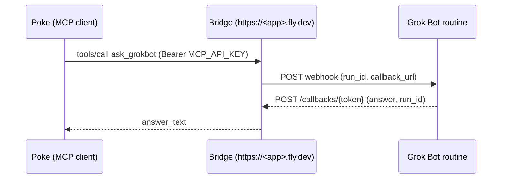

# grokbot-mcp-bridge

English | [日本語](README.ja.md)

**What it does:** lets Poke — or any MCP client — ask a Grok Bot a question and get the answer back as a normal tool result, even though Grok Bot can only reply asynchronously via a webhook callback.

**Who it is for:** anyone who can deploy a small app to Fly.io and has a Grok Bot routine with a Web webhook trigger. No knowledge of MCP internals is needed; the quick start below is copy-paste.

**How:** the bridge holds the Cursor webhook URL/key server-side, so Poke only ever sees the bridge URL and one API key you generate.

## How it flows



## Documentation

| Document | English | 日本語 |
|---|---|---|
| Overview (this file) | [README.md](README.md) | [README.ja.md](README.ja.md) |
| Bridge specification and operations | [SPEC.md](SPEC.md) | [SPEC.ja.md](SPEC.ja.md) |
| Calling Grok Bot from Poke | [poke-invocation.md](poke-invocation.md) | [poke-invocation.ja.md](poke-invocation.ja.md) |

## Quick start (Poke → Grok Bot in four steps)

`<app>` below is `app` in `fly.toml` (defaults to `grokbot-mcp-bridge`).

### 0. Which value goes where

#### Required (3 secrets + 1 URL)

| Value | Where you get it | Where you enter it |
|---|---|---|
| `CURSOR_WEBHOOK_URL` | Grok Bot app → the routine with the **Web webhook** trigger → "POST URL" (`https://api2.cursor.sh/automations/webhook/…`) | Fly secret on the bridge (step 2) |
| `CURSOR_WEBHOOK_API_KEY` | Same screen → "Key" (`crsr_…`). Copy only the key, not the `Authorization: Bearer` header line | Fly secret on the bridge (step 2) |
| `MCP_API_KEY` | Generate yourself (`openssl rand -hex 32`) | Fly secret (step 2) **and** Poke → New Integration → "API Key" (step 3) — same value in both |
| `https://<app>.fly.dev/mcp` | Fixed by the bridge | Poke → New Integration → "Server URL" (step 3) |
| Grok Bot routine instructions | This repo: [poke-invocation.md § 4](poke-invocation.md#4-incoming-webhook-bridge--grok-bot) (ready-to-paste template) | Grok Bot app → the same routine → "Instructions" field |

Routine screen: chat header → info panel → Routines → Web webhook.

#### Optional (skip on first setup)

| Value | Where you get it | Where you enter it |
|---|---|---|
| `INBOUND_WEBHOOK_SECRET` | Generate yourself (optional) | Fly secret (step 2), and the Grok Bot-side push routine if you use `POST /hooks/grokbot` |

Only for push delivery via `POST /hooks/grokbot` (`list_grokbot_events`). Not needed for `ask_grokbot`.

### 1. Prepare the Grok Bot webhook

In the Cursor automation that runs Grok Bot, enable the webhook trigger and copy its URL and `crsr_…` API key. They become `CURSOR_WEBHOOK_URL` / `CURSOR_WEBHOOK_API_KEY` and are stored only on the bridge — Poke never sees them.

The routine's Instructions field must tell Grok Bot to echo `run_id` and POST the answer to `callback_url` — paste the template from [poke-invocation.md § 4](poke-invocation.md#4-incoming-webhook-bridge--grok-bot).

### 2. Deploy the bridge to Fly.io

Log in with `flyctl auth login`, or for non-interactive use create a token at https://fly.io/tokens and export it as `FLY_API_TOKEN` (tokens have an expiry you choose at creation; renew before it lapses).

```bash
export MCP_API_KEY="$(openssl rand -hex 32)"            # keep this value: Poke needs it in step 3
export INBOUND_WEBHOOK_SECRET="$(openssl rand -hex 32)" # optional (push delivery only)
flyctl apps create <app>
flyctl volumes create bridge_data -r <region> -s 1 -a <app> --yes   # SQLite lives on /data
flyctl secrets set -a <app> \
  CURSOR_WEBHOOK_URL="$CURSOR_WEBHOOK_URL" \
  CURSOR_WEBHOOK_API_KEY="$CURSOR_WEBHOOK_API_KEY" \
  MCP_API_KEY="$MCP_API_KEY" \
  INBOUND_WEBHOOK_SECRET="$INBOUND_WEBHOOK_SECRET" \
  ALLOWED_HOSTS=<app>.fly.dev \
  DB_PATH=/data/bridge.db
flyctl deploy --remote-only --ha=false -a <app>
```

- `MCP_API_KEY` and `INBOUND_WEBHOOK_SECRET` are **not** issued by Poke or Cursor; you generate them yourself. `echo "$MCP_API_KEY"` shows it in the same shell — Poke needs the same value in step 3, and Fly does not show secret values again.
- `INBOUND_WEBHOOK_SECRET` is optional. Without it, `POST /hooks/grokbot` returns 503 and `bridge_status` reports `inbound_webhook_secret_configured: false`; `ask_grokbot` still works.

### 3. Connect Poke

Add an MCP integration in Poke with:

| Field | Value |
|---|---|
| Name | any label, e.g. `grokbot-mcp-bridge` |
| Server URL | `https://<app>.fly.dev/mcp` (Streamable HTTP). Use `https://<app>.fly.dev/sse` if the client only supports SSE |
| API Key | the value of `MCP_API_KEY` (no `Bearer ` prefix). Poke labels this field optional, but leave it empty and Poke will try OAuth and fail — always set it |

### 4. Verify end to end

1. `GET https://<app>.fly.dev/healthz` → `200 {"ok":true}`
2. From Poke, call `bridge_status` → `webhook_url_configured` and `webhook_api_key_configured` are `true` (`inbound_webhook_secret_configured` is `false` if you skipped the optional secret — that is fine)
3. From Poke, call `ask_grokbot` with `payload={"message": "Introduce yourself briefly."}`, `wait_seconds=60`
   - `answer_status: "answered"` → `answer_text` holds the reply
   - `answer_status: "pending"` → call `wait_for_grokbot_answer(run_id, timeout_seconds=120)`

   Sample result:

   ```json
   {
     "ok": true,
     "run_id": "06eec502-cf7b-468d-8307-8dcf945e1f17",
     "answer_status": "answered",
     "answer_text": "…the reply text…",
     "summary": "Grok Bot answered: …"
   }
   ```

4. `flyctl logs -a <app>` shows `run created` → `callback resolved` → `trigger returning`

For the Grok Bot-side contract (echoing `run_id`, posting to `callback_url`) and troubleshooting, see [poke-invocation.md](poke-invocation.md).

## Endpoints

- `GET /healthz`
- `GET /`
- `POST /mcp` (authenticated MCP)
- `GET /sse` and `POST /messages/` (authenticated MCP)
- `POST /hooks/grokbot` (signed inbound Grok Bot events)
- `POST /callbacks/{token}` (Grok Bot answers)

## MCP tools

- `bridge_status`
- `ask_grokbot`
- `get_grokbot_run`
- `wait_for_grokbot_answer`
- `list_grokbot_runs`
- `list_grokbot_events`
- `get_grokbot_event`

Resources are available at `grokbot://events` and `grokbot://runs`.

## Environment variables

`CURSOR_WEBHOOK_URL`, `CURSOR_WEBHOOK_API_KEY`, `MCP_API_KEY`,
`INBOUND_WEBHOOK_SECRET`, `DB_PATH`, `ALLOWED_HOSTS`, `PUBLIC_BASE_URL`,
`CALLBACK_TTL_SECONDS`, `CALLBACK_ALLOW_HTTP`, and `CALLBACK_ALLOWED_HOSTS`.

## Callback contract

Grok Bot should POST JSON such as:

```json
{"ok": true, "answer": "...", "run_id": "<echoed uuid>"}
```

The `run_id` (or `request_id`) must echo the UUID sent by `ask_grokbot`.
When an inbound webhook has no callback URL, the bridge returns
`「コールバックURLなし」` ("no callback URL") and records the event without
delivering a callback.

## Commands

```bash
uv run --extra dev pytest -q               # tests
uv lock && uv export --no-dev --format requirements-txt --no-emit-project -o requirements.txt   # update pinned deps
flyctl deploy --remote-only --ha=false     # deploy (app / region come from fly.toml)
```

## License

MIT — see [LICENSE](LICENSE).
